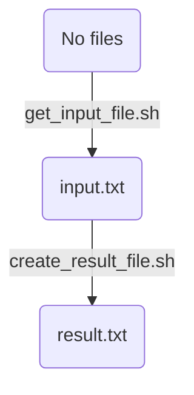

# nextflow_example_5

[Nextflow example](https://github.com/richelbilderbeek/nextflow_examples) 5:
my first own minimal Nextflow script

Goals:

 * Create a file in the first step, use it in the next
 * Do not use a container

